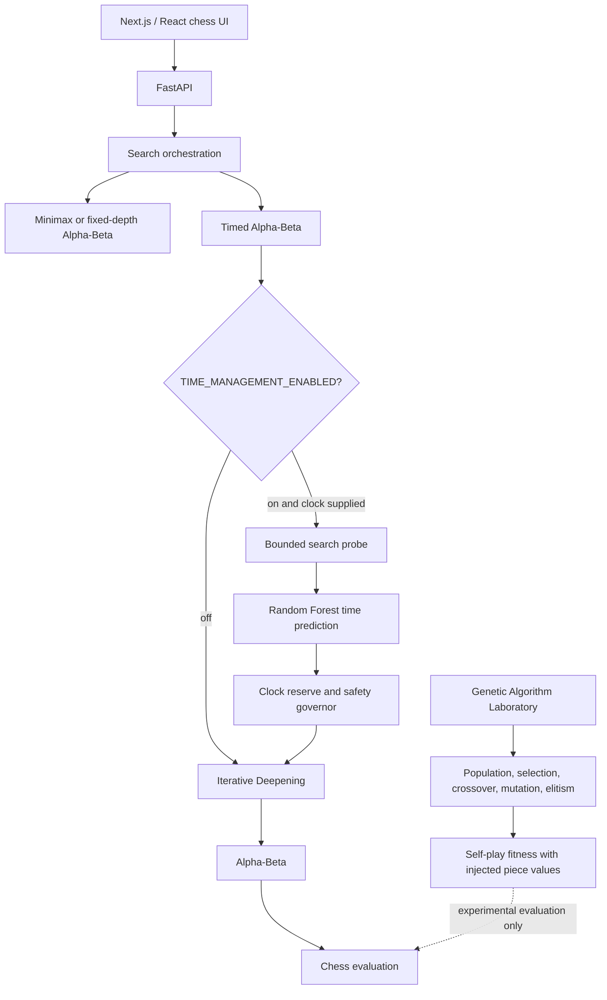

# ♟️ Chess AI — Search, Time Management & Evolution

An experimental chess platform that combines custom game-tree search, an optional machine-learning time-budget policy, and a Genetic Algorithm laboratory for chess evaluation parameters. Play through a Next.js interface, inspect search telemetry, and run reproducible evolutionary experiments through a FastAPI service.

**Classical search:** Alpha-Beta pruning and iterative deepening.

**Machine learning:** Random Forest regression for experimental search-time allocation.

**Evolutionary optimization:** selection, crossover, mutation, elitism, and lineage tracking.

**Engineering:** Python/FastAPI backend, TypeScript/Next.js frontend, and automated tests.

[](https://www.python.org/)
[](https://fastapi.tiangolo.com/)
[](https://nextjs.org/)
[](https://react.dev/)
[](https://scikit-learn.org/)
[](https://www.typescriptlang.org/)

## 🚀 Demo

[Open the Chess AI web app](https://chesst1024.vercel.app/)

Screenshots are placeholders until project captures are added. Put images in `docs/images/` and replace the matching placeholder below; no mock screenshots are included.

| Chess gameplay | Genetic Algorithm Laboratory |
| --- | --- |
| _Screenshot placeholder — `docs/images/chess-gameplay.png`_ | _Screenshot placeholder — `docs/images/genetic-lab.png`_ |

| Time Management | Experiment results |
| --- | --- |
| _Screenshot placeholder — `docs/images/time-management.png`_ | _Screenshot placeholder — `docs/images/evolution-results.png`_ |

<!-- Replace the screenshot placeholders with Markdown images after capturing the real UI. -->

## 🎯 Why this project?

- Built Alpha-Beta search and iterative deepening with deadlines and usable completed-depth results.
- Added a Random Forest regression pipeline and an opt-in policy that allocates search time under a chess clock.
- Designed a Genetic Algorithm laboratory to evaluate piece-value chromosomes through self-play.
- Recorded search telemetry, fitness, termination reasons, and parent-to-child lineage for experiments.
- Connected the engine and experiments to an interactive React frontend through FastAPI endpoints.

## 🧠 System at a glance



The system keeps move search, search-time allocation, and experimental evaluation tuning in separate components. Time Management is opt-in; the Genetic Algorithm uses an injected evaluator and does not silently change the default production piece values.

## 🔥 Key engineering features

| Area | Implementation |
| --- | --- |
| Search | Minimax, Alpha-Beta pruning, and iterative deepening |
| Time Management | Optional Random Forest time prediction, bounded probe, and safety governor |
| Regression | Random Forest and Gradient Boosting baselines with a training-median comparison |
| Evaluation optimization | Genetic Algorithm over pawn, knight, bishop, rook, and queen values |
| Evolution | Tournament selection, crossover, mutation, elitism, stable IDs, and lineage |
| Backend | FastAPI JSON APIs and streamed Genetic Lab evaluation |
| Frontend | Next.js, React, and TypeScript |
| Chess rules | `python-chess` on the backend and `chess.js` in the frontend |
| Observability | Move depth, nodes, timing, clock, game result, and termination telemetry |

## ⏱️ ML Time Management

The model estimates a time budget. It does not choose a chess move or directly select a search depth.

```text
Position and clock
        ↓
Feature extraction + bounded search probe
        ↓
Random Forest regression
        ↓
Predicted time budget
        ↓
Clock reserve and safety cap
        ↓
Iterative Deepening with Alpha-Beta
```

The model is trained against `teacher_time_ms` labels. When `TIME_MANAGEMENT_ENABLED=true` and the request includes the remaining clock, the API can use the predicted budget for timed Alpha-Beta search. The default is disabled. If the policy or model cannot provide a usable budget, the engine has a bounded fallback path. Runtime shadow logging is diagnostic and does not alter a search that has already completed.

### Held-out result

The Phase 2F.2 report evaluates the frozen Random Forest on 100 held-out records from 20 FEN groups, with zero FEN overlap between training and held-out groups.

| Predictor | MAE | RMSE | R² |
| --- | ---: | ---: | ---: |
| Random Forest | 88.08 ms | 125.63 ms | 0.512 |
| Training-median baseline | 144.12 ms | 207.64 ms | -0.332 |

These are **oracle-telemetry** results: the feature set includes bounded-search telemetry that is not available before probing. On the 15 exact-label rows available for the separate pre-search probe comparison, the 25 ms probe had 189.44 ms MAE versus 125.40 ms for the same-row median baseline. The current evidence does not establish stronger chess play or reliable pre-search time prediction.

## 🧬 Genetic Algorithm Laboratory

Instead of manually tuning material values, the laboratory evolves candidate evaluation weights through repeated games. A chromosome is ordered as:

```text
[P, N, B, R, Q]
```

Each candidate is evaluated under the configured game and clock conditions. Where configured, games cover both White and Black; the baseline is included in the opponent pool. Fitness is:

```text
Fitness = Wins - Losses
```

Tournament selection chooses parents, uniform crossover inherits genes, mutation changes selected values, and elitism carries top candidates into the next generation. Stable individual IDs connect each child to its parents, inherited genes, mutations, and final chromosome.

```text
Parent A ──┐
           ├── Crossover ── Mutation ── Child
Parent B ──┘
```

The laboratory also supports versioned experiment checkpoints and a persistent Individual Bank. Saved genomes can seed a new experiment while keeping their stable IDs and source lineage. Checkpoints and bank entries are local JSON data under `Chess_AI/data/genetic_lab/`; they are not production evaluator changes.

## 📊 Experiments and limitations

- The held-out ML comparison above reports model error against the training-median baseline; the oracle-telemetry caveat is material.
- GA reports include wins, draws, losses, termination reasons, and plies so a high draw rate can be diagnosed rather than mistaken for a strong result.
- An existing termination investigation recorded 200 of 200 games ending by automatic fivefold repetition. Repeated-position cycles are a known limitation in that experiment, not evidence that evolved weights improved playing strength.
- Piece-value chromosomes are a simplified evaluation space. Fitness depends on the opponents, clock, and game limits used in each experiment.

## 🛡️ Reliability and telemetry

- Iterative deepening retains the best fully completed search result if the next depth reaches its deadline.
- Time Management applies a clock reserve and a safety governor before passing a budget to search.
- A legal-move fallback is used when the available clock leaves no search budget.
- Runtime shadow inference and logging are isolated from the completed search result.
- Genetic experiments record configuration, seed, W/D/L, termination reason, plies, and lineage for later inspection.

## 🏗️ Project structure

```text
Chess/
├── Chess_AI/
│   ├── app/
│   │   ├── api/                 # FastAPI routes, including the Genetic Lab
│   │   ├── engine/              # Minimax, Alpha-Beta, timed search, evaluation
│   │   ├── learning/
│   │   │   ├── genetic/         # Fitness, selection, operators, persistence
│   │   │   └── time_management/ # Dataset, teacher, training, evaluation, policy
│   │   └── schemas/             # Request and response models
│   ├── data/time_management/    # Versioned datasets, reports, and model artifacts
│   └── tests/                   # Backend and learning tests
├── src/
│   ├── app/                     # Next.js pages, Chess and Genetic Lab
│   └── lib/                     # API clients and frontend chess logic
└── tests/                       # Frontend Vitest tests
```

Generated Genetic Lab checkpoints, bank entries, and runtime shadow logs are local data and are excluded from Git.

## 🧰 Tech stack

| Category | Technologies |
| --- | --- |
| Language | Python, TypeScript |
| Backend | FastAPI, Uvicorn |
| Frontend | Next.js, React |
| Machine learning | scikit-learn, NumPy, joblib |
| Chess | `python-chess`, `chess.js` |
| Testing | Python `unittest`, Vitest, TypeScript typecheck |
| Version control | Git |

## 🚀 Quick start

### 1. Start the backend

From the `Chess_AI/` directory:

```powershell
python -m venv .venv
.venv\Scripts\Activate.ps1
python -m pip install -r requirements.txt
uvicorn app.main:app --reload
```

The API listens at `http://127.0.0.1:8000`. The health endpoint is `http://127.0.0.1:8000/health`.

### 2. Start the frontend

In a second terminal from the repository root:

```powershell
npm ci
npm run dev
```

Open `http://localhost:3000`. The frontend uses `http://127.0.0.1:8000` by default. Set `NEXT_PUBLIC_CHESS_AI_URL` before starting Next.js when the API is hosted elsewhere.

To opt into the model-based time-budget policy, set this in the backend terminal before starting Uvicorn:

```powershell
$env:TIME_MANAGEMENT_ENABLED = "true"
uvicorn app.main:app --reload
```

The chess search endpoints are `/api/ai/move` and `/api/ai/move/timed`. The Genetic Algorithm Laboratory is available at `/laboratory/genetic` and under `/api/lab/genetic/*`.

## 🧪 Tests

Run backend tests from `Chess_AI/`:

```powershell
python -m unittest discover -s tests -v
```

Run frontend tests and typecheck from the repository root:

```powershell
npm test -- --run
npm run typecheck
```

The test suites cover chess search and clock behavior, time-management data and evaluation, Genetic Algorithm operators and persistence, and frontend chess/laboratory behavior.

## ⚠️ Limitations and future work

- Search currently uses Alpha-Beta without transposition tables or advanced move ordering.
- Time Management is optional and experimental; current held-out results do not prove chess-strength gains.
- Genetic fitness is noisy at small game counts and depends on the experiment's opponent pool and termination limits.
- The Genetic Lab is an experimentation tool; its material weights do not automatically replace production evaluation values.
- Future evaluation work could add piece-square tables, mobility, king safety, and pawn-structure features, then validate them on larger held-out opponent sets.

## 🔗 Links

- [Live demo](https://chesst1024.vercel.app/)
- GitHub repository: _add repository URL_
- Demo video: _add link_
- Author: _add name and profile_
